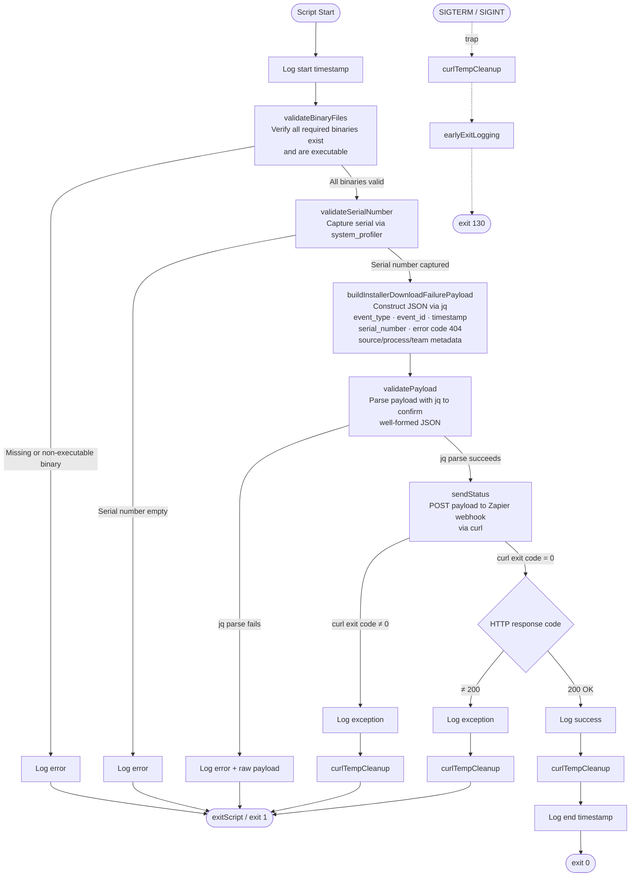

# standard-device-setup-event-webhook

## SDS - Submit - Failure Report

Reports an install download failure event to a Zapier webhook as a structured JSON payload. Runs as part of the Standard Device Setup (SDS) workflow when the primary installer download source is unavailable.

### Workflow



### JSON Payload Structure

```json
{
  "event_type": "com.company.standard.installer.download-failure",
  "event_id": "<uuid>",
  "timestamp": "<ISO-8601-UTC>",
  "summary": "Installer Download Failed",
  "description": "*Standard Device Setup* - resorted to FALLBACK download source",
  "data": {
    "source_system": "sample-installer",
    "impact": {
      "process": "Sample Installer Download",
      "environment": "production",
      "managing_team": "Systems Engineers"
    },
    "device": {
      "serial_number": "<device-serial>"
    },
    "error": {
      "code": 404,
      "message": "failed to download from PRIMARY download source: ..."
    }
  }
}
```